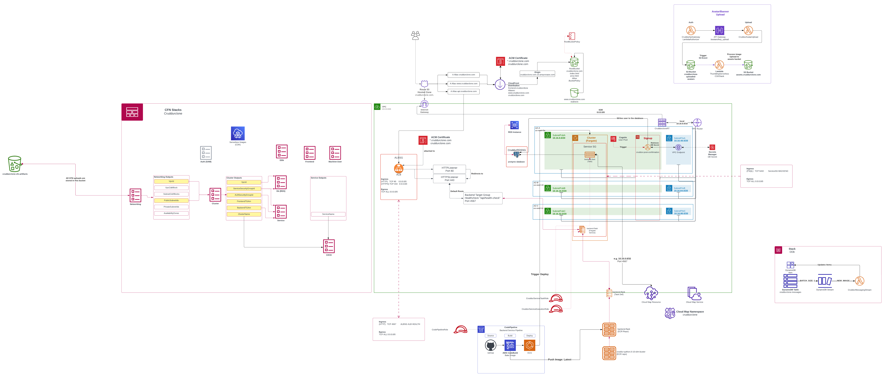
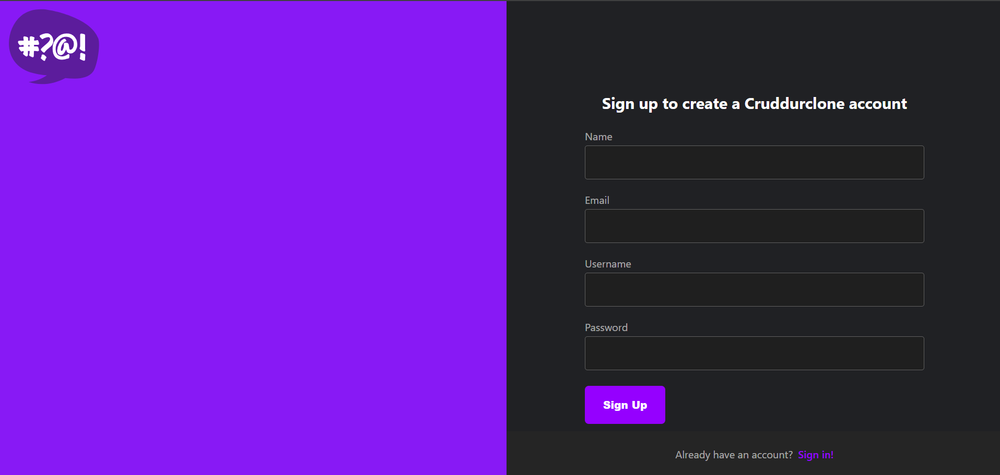
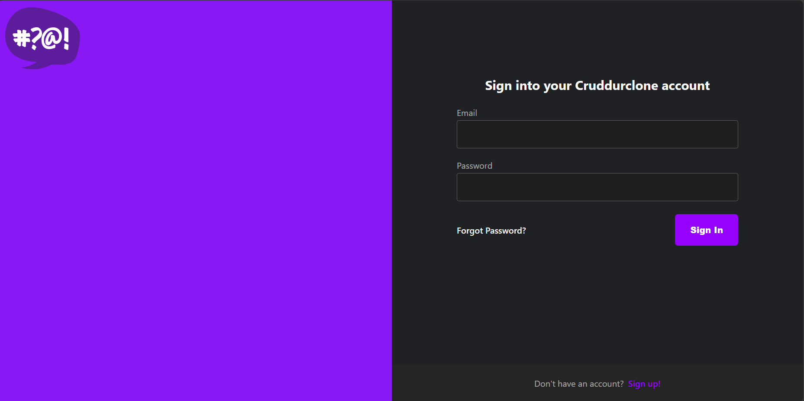
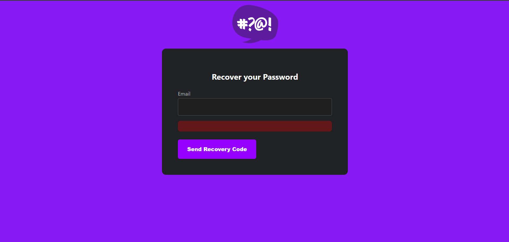
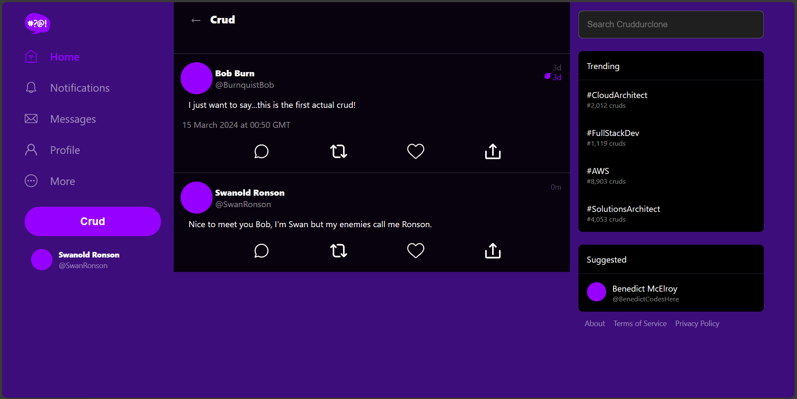
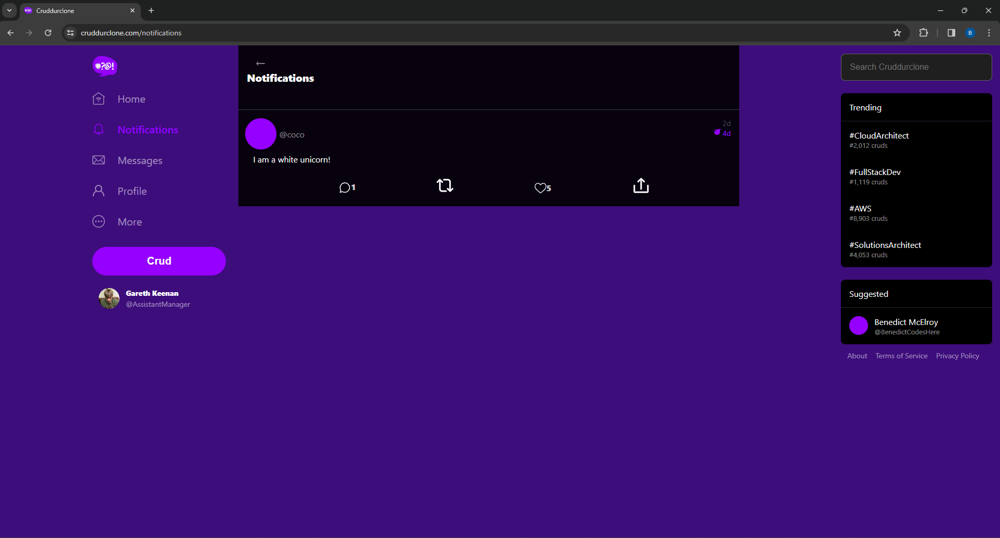
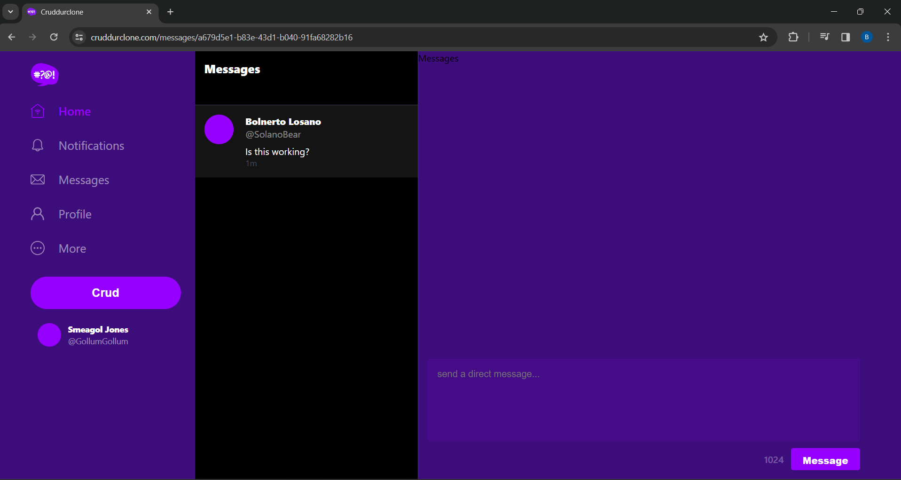
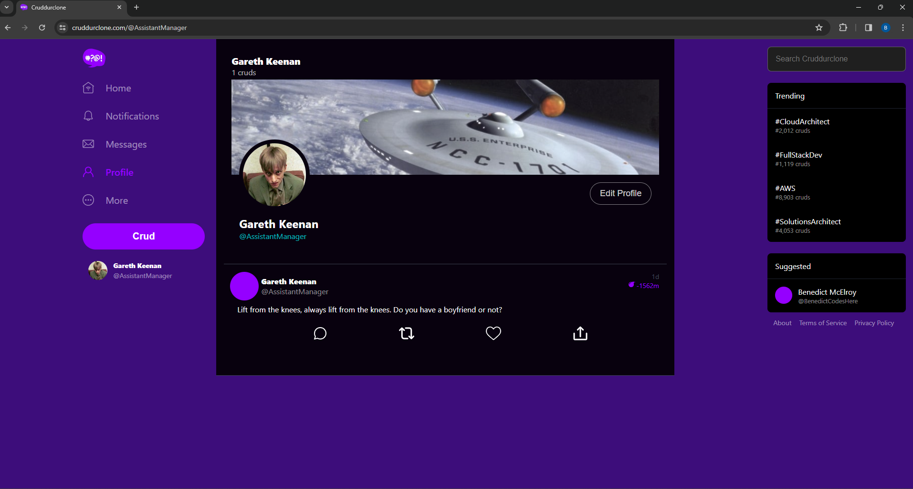

# Cruddurclone

## Contents

[Overview](#overview)

[Skills and Tech Stack](#skills-and-tech-stack)

[Screenshots](#screenshots)

[Project Journal](#project-journal)

[Credits](#credits)

## Overview
This application is designed to be a microblogging service in which users can create posts, reply to others, direct message other users, search the application, view the trending posts about certain topics.

The posts can be created as temporary posts, set to expire, the time range selected by the user from a dropdown list.

The main incentive for creating this application was to demonstrate my capacity to build a production-grade fullstack application that is hosted on and integrated with AWS services.

## Skills and Tech Stack
The skills that are demonstrated in the development of this project include:
- Application Architecture design (LucidChart)
- Cloud networking configuration and routing (Virtual Private Cloud, Security Groups, Route 53)
- Scaling and load balancing (Application Load Balancer, Elastic Container Service, Target Groups)
- Responsive frontend web development (React, CSS)
- Efficient and secure backend development (Python, Flask, Elastic Container Service, Postgres, Relational Database Service, DynamoDB)
- Managing containerized applications (Docker, Elastic Container Registry, Elastic Container Service)
- Deploying architecture using YAML templates (CloudFormation)
- Continuous Integration pipelines (CodeDeploy, Codebuild, CodePipeline)
- Shell scripting for numerous dev tasks (e.g. seeding database data)
- Security (Security Groups, Secrets Manager, Systems Manager Parameter Store, Identity and Access Management)
- Storage (S3)
- Static Website Hosting (S3)
- Cache management and invalidation (CloudFront)
- Serverless where it makes sense (Lambda)
- Observability and Monitoring (XRay, CloudWatch Logs, CloudTrail)
- Cloning and modifying an open-source RubyGem's codebase for use with AWS STS, to aid with continuous development 
(https://github.com/BenedictCodesHere/aws_s3_website_sync)

Please see the [Project Journal](#project-journal) for a more comprehensive overview of my skills and the journey of building the application.

## Architectural Diagram

On the left of the diagram:
- `CloudFormation stacks` that you will find in `./aws/cfn/`
- `Serverless Images (CDK)`

The centre/right:
- `VPC`,
- `Subnets`,
- `Security Groups`,
- `Load Balancer`,
- `Route Tables`,
- `Secrets Manager VPC Endpoint`,
- `Fargate Cluster`,
    - `Fargate Service`
- `RDS Instance`,
- `Postgres Database`
- 
- User Processes
    - `Signup`

Along the bottom:
- `Backend Service Pipeline`
    - `Source`: `Github`
    - `Build`: `Codebuild`
    - `Deploy`: `ECS`
- `ECR Repo(s)`
    - `backend-flask ECR repo`
    - `cruddur-python:3-10-slim-buster ECR repo`
- `ECS Task Definition`
- `Cloud Map Namespace`
    - `Cloud Map Resource`
    - `Cloud Map Service`
- `IAM Roles`
    - `CodePipelineRole`
    - `CruddurServiceTaskRole`
    - `CruddurServiceExecutionRole`

To the right:
- `CloudFormation DynamoDB Stack`
    - `DynamoDB table`
    - `DynamoDB Stream`
    - `CruddurMessagingStream Lambda`

Top-right:
- User Processes
    - `Avatar/Banner Upload`
        - `API Gateway Lambda Authorizer`
        - `API Gateway Endpoint`
        - `API Gateway Integrated Lambda`
        - `S3 Bucket for initial image upload`
        - `Lambda for converting image`
        - `S3 Bucket for processed image`

Top: 
- `Route 53 Hosted Zone`
    - `Route 53 Alias (A) Records`
    - `ACM Certificate`
    - `CloudFront Distribution`
    - `CloudFront Origin`
    - `RootBucket for static website`
    - `WWWBucket for redirects`
    - `RootBucketPolicy`

## Screenshots

`SignupPage`:

`SigninPage`:

`RecoverPage`:

`HomeFeedPage`:

`NotificationsFeedPage`:

`MessageGroupPage`:

N.B currently working on fixing some bugs in the messaging feature in production.

`UserFeedPage`:

## Project Journal

The `/journal` directory contains information about the work that I undertook during the project, the development of the application, and the skills learned.

- [Week-0-overview](./journal/week0-overview.md)
- [week01-containerization](./journal/week01-containerization.md)
- [week02-tracing](./journal/week02-tracing.md)
- [week03-jwt-auth-and-verification](./journal/week03-jwt-auth-and-verification.md)
- [week04-sql-db-rds](./journal/week04-sql-db-rds.md)
- [week05-nosql-db-dynamodb](./journal/week05-nosql-db-dynamodb.md)
- [week06-deploying-container](./journal/week06-deploying-container.md)
- [week07-load-balancing-and-cors](./journal/week07-load-balancing-and-cors.md)
- [week08-serverless-and-cdk](./journal/week08-serverless-and-cdk.md)
- [week09-ci-cd-codepipeline](./journal/week09-ci-cd-codepipeline.md)
- [week10-cloudformation](./journal/week10-cloudformation.md)
- [week11-fixing-issues](./journal/week11-fixing-issues.md)
- [week12-post-week](./journal/week12-post-week.md)

## Credits
The codebase that is contained in the initial commit is thanks to the repository:

https://github.com/ExamProCo/aws-bootcamp-cruddur-2023

Special thanks go to the originators of this codebase:

Andrew Brown
https://github.com/omenking 

Andrew Bayko
https://github.com/bayko
