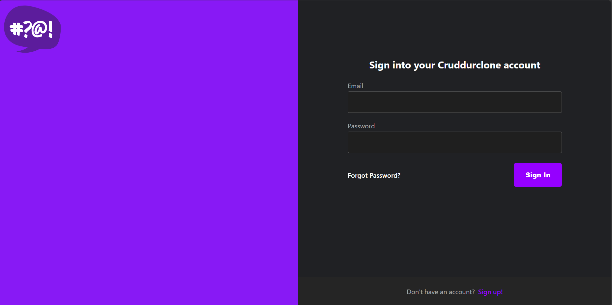

# Week 3 - Cognito JWT and Verification

## Aim
The aim this week is to provide decentralized authentication via AWS Amplify and Amazon Cognito, and client-side JSON Web Token (JWT) verification. 

The desired outcome for the UX is to be able to create a user via email and password, be issued with a confirmation email, have that confirmation email update the confirmed status of the user, and allow the user to be able to view a differentiated, logged in version of the application, and for the user to be ideally be able to revisit that webpage on the browser and remain logged in for a given duration.

## Tech Stack
### Amazon/AWS
AWS Amplify
Amazon Cognito
AWS Lambda

### Languages
JavaScript (front-end)
Python (backend)


## AWS Amplify/Cognito
AWS Amplify Auth, which relies on AWS Cognito, is what we are using to authenticate users in our application. We set this up via
imports in the codebase, and it relies on reading a created user from the user pool in Amazon Cognito, and then issuing a JWT which will expire after a given time period, but which is used to authenticate the user's identity on the client side, and allow them to access the logged in version of the application.

## Logged Out vs Logged In



## Pages
The focus of this week is getting the AUTHENTICATION subset of pages to function correctly:
### SignupPage:
  - The user should be able to create a new account via adding their email and creating a handle, display name, and password. This should create a new user in the Cognito User Pool, and the RDS instance should contain the user's handle.

### SigninPage:
  - The user should be able to sign in using their email and password to the application. The email and password will be checked against the Cognito User Pool data to validate. If successful, the user's handle and display name will propagate from RDS and the user will be logged into the application.

### ConfirmationPage:
  - The confirmation page is a secondary step to ensure that users have a valid email address set up, trying to mitigate some of the potential for spam/bot account creation. The user will need to enter a passcode from a verification email which is issued via Amazon SNS. Upon acceptance, the email will show as confirmed in the Cognito User Pool.
### RecoverPage:
  - In case of a 'forgot password' situation, the user can recover their account by a similar passcode email sent to the email address on file. The user will need to enter the correct registered email address and have access to this email in order to recover their account.

## Fetching data from backend
In order to populate data from the backend, we fetch the data from the application route endpoint "/api/activities/home":

In [frontend-react-js/src/pages/HomeFeedPage.js](https://github.com/BenedictCodesHere/aws-bootcamp-cruddur-2023/blob/main/frontend-react-js/src/pages/HomeFeedPage.js):

```js
    const backend_url = `${process.env.REACT_APP_BACKEND_URL}/api/activities/home`
      const res = await fetch(backend_url, {
        headers: {
          Authorization: `Bearer ${localStorage.getItem("access_token")}`
        }, 
        method: "GET"
      });
```

This uses the JWT which is saved as access_token in localStorage to authenticate the user.

In `frontend-react-js/src/lib/CheckAuth.js`:

```js
export async function getAccessToken(){
  Auth.currentSession()
  .then((cognito_user_session) => {
    const access_token = cognito_user_session.accessToken.jwtToken
    localStorage.setItem("access_token", access_token)
  })
  .catch((err) => console.log(err));
}
```

```js
export async function checkAuth(setUser){
  Auth.currentAuthenticatedUser({
    // Optional, By default is false. 
    // If set to true, this call will send a 
    // request to Cognito to get the latest user data
    bypassCache: false 
  })
  .then((cognito_user) => {
    setUser({
      display_name: cognito_user.attributes.name,
      handle: cognito_user.attributes.preferred_username
    })
    return Auth.currentSession()
  }).then((cognito_user_session) => {
      localStorage.setItem("access_token", cognito_user_session.accessToken.jwtToken)
  })
  .catch((err) => console.log(err));
};
```

With these functions we are able to verify the user's identity to authenticate them, and once authenticated this authorizes them to access their personalized UX, with
customized homepage, feed, messaging etc.

The functions are imported on every page where the authorization needs to be checked. For example:

### HomeFeedPage:
```javascript
// check when the page loads if we are authenicated
  React.useEffect(()=>{
    //prevents double call
    if (dataFetchedRef.current) return;
    dataFetchedRef.current = true;

    loadData();
    checkAuth(setUser);
  }, [])
```


## Preventing Unauthorized Requests
- Need to protect API endpoints
- Pass along access token stored in LocalStorage


### Backend

In `app.py`:

```py

def data_home():
  
  print(
    request.headers.get('Authorization')
  )
  app.logger.debug("Request headers:")
  app.logger.debug(request.headers)
  access_token = CognitoJwtToken.extract_access_token(request.headers)
  try:
      claims = cognito_jwt_token.verify(access_token)
      # authenticated request
      app.logger.debug("authenticated")
      app.logger.debug("claims")
      app.logger.debug(claims)
      app.logger.debug(claims["username"])
      data = HomeActivities.run(cognito_user_id=claims['username'])
  except TokenVerifyError as e:
    # unauthenticated request
      app.logger.debug(e)
      app.logger.debug("unauthenticated")
      data = HomeActivities.run()


  

  # data = HomeActivities.run()  # logger=LOGGER in brackets
  # claims = aws_auth.claims
  
  return data, 200

  ```
This grabs the Authorization header from the request being made by the frontend when the user hits the ```api/activities/home``` endpoint.
There is a method being invoked, ```CognitoJwtToken.extract_access_token(param)```, where the ```param``` is ```request.headers```. This class is stored in the ```lib``` folder.

In ```lib/cognito_jwt_token.py```

```py
@classmethod
    def extract_access_token(self, request_headers):
        access_token = None
        auth_header = request_headers.get("Authorization")
        if auth_header and " " in auth_header:
            _, access_token = auth_header.split()
        return access_token

```

This grabs the second part of the authorization header, i.e. the Authorization token itself, from the ```request_headers``` parameter.

### CORS Preflight issue
To prevent Cross-Origin Resource Sharing (CORS) pre-flight blocks, CORS needs to be configured in the application to allow the Authorization headers to pass from one origin to the other.

In the `app.py`:
```py
cors = CORS(
  app, 
  resources={r"/api/*": {"origins": origins}},
  headers=['Content-Type', 'Authorization'], 
  expose_headers='Authorization',
  methods="OPTIONS,GET,HEAD,POST"
)
```


## Using the Sub Attribute for a Cognito Identity
We use the `sub` attribute of a Cognito identity to write the user to our database, and retrieve data also based on this sub. This means that when the user logs in to the application, the sub attribute will be used to query the RDS database and retrieve the user's profile information.
