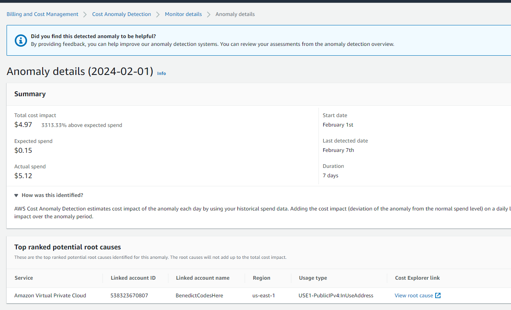
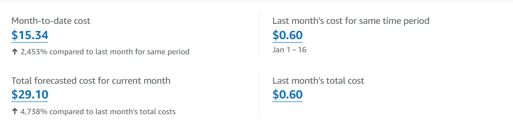
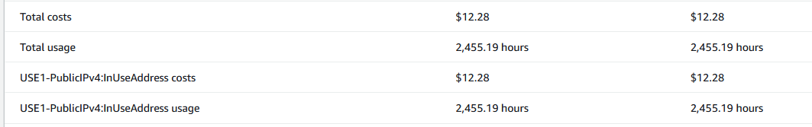
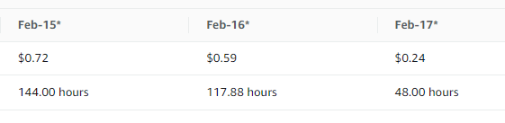

# Week 8 — Serverless Image Processing

## Aim
The aim this week was being able to upload avatars, render them correctly and return the correctly resized versions for use as the profile picture of the user.
The tech stack used is:
- AWS CDK (Typescript)
- Amazon S3
- AWS Lambda
- Amazon SNS
- AWS IAM
- Amazon CloudFront

AWS CDK is listed first as this is the method by which we are implementing the desired outcomes in the other Amazon services.

CDK is a Cloud Development Kit, which is a way of utilising the desired coding language (Typescript) to define and create instances of 
other services within AWS.

## Serverless Image Process CDK
IN "./":
Created a thumbing-serverless-cdk directory. This is where the CDK files are stored.

IN "./thumbing-serverless-cdk/lib/thumbing-serverless-cdk-stack.ts":
    Defined and created instances of:
- CDK Stack
- lambda function
- topic and subscription
- s3 event notifications
- Bucket access policies

Also attached policies to roles.


## Serving Avatars Via CloudFront
We want to create a CloudFront distribution in order to serve the avatar assets in the quickest and most available manner.
In the AWS UI:
- Chose the origin domain
- Origin access control settings (restrict bucket access to only CloudFront)
- Update S3 Bucket Policy (policy generated by CloudFront, CloudFront doesn't auto-attach policy to the bucket)
- Create Cache Policy
- Create an SSL certificate using ACM

Adding CDK in the folder ./thumbing-serverless-cdk

import s3 object from aws-cdk-lib

define bucket(scope, id, props)

cdk synth

cdk bootstrap - bootstraps for account, region

## Lambda source code

### Prior to CDK Deploy:
Run 'npm install' in the 'process-images' directory
- Otherwise lambda function will hit errors due to missing modules


ERRORS - bucket name incorrect

The original bucket was being published under "cruddur-thumbs" in the example. After changing bucket name and redeploying, the bucket name remained "cruddur-thumbs". The stack itself had to be torn down in order to rename the bucket.

Then it was discovered that it was environment variables (used grep to check) that were causing this issue.

Environment variable chain/hierarchy is always important to understand and check.

On CDK Deploy:

The lambda function and the bucket are created, and alongside them, IAM service roles are created.


## CLOUDFRONT

- ACM for CloudFront must be hosted in us-east-1

- Set up Route 53 - alias to assets.cruddurclone.com

- Adding the bucket policy from CloudFront to attach to the S3 bucket


## Architecture - S3
- Separating the bucket into assets bucket and processed bucket
    - Advantage of being able to lock down the originals bucket and separate so only processed is publicly served


## Serverless Image Process CDK


## Serving Avatars Via CloudFront
We want to serve the images via CloudFront


## Implement Migrations Backend Endpoint and Profile Form

In order to be able to do migrations, we may need to have some kind of Object Relational Mapper (ORM). We are choosing to avoid using a library for this for both reasons of streamlining (avoiding introducing unnecessary dependencies which entail potential security risks) and because the suitability of certain libraries may not fit our goal. 

We will have a table in our database called `information-schema ` which will store the last successful run. We can use that as a reference point to know which migration files to run and which ones not to run.

We instead create a `bin/generate/migration` file.

We create a `bin/db/migrate` and `bin/db/rollback` 

in `frontend-react-js/jsconfig.json`:

```json

{
    "compilerOptions": {
        "baseUrl": "src"
    }, 
    "include": ["src"]
}

```

This allows imports from the `src` folder directly into the root directory of the `frontend-react-js`, allowing for greater configurability of imports.

We also created an `update_profile.py` service which writes an update to the database for the relevant profile information.


## Generating Presigned URLs for Avatar Uploads
We make a `function.rb` file in `aws/lambdas/cruddur-upload-avatar/` and a `gemfile` to manage the ruby module.

The aim is to generate and return a presigned URL using this function for use in our application.

We install an extension called `Thunder Client` which is a Postman alternative for VS Code.

The idea is that we will create an endpoint which returns the presigned URL for the upload, and we pass the data in as binary in the body to the presignedURL using a PUT request.

We should instantiate the Lambda Authorizer outside of the Lambda handler to allow for the verifier's cache to be reused for subsequent requests, if the Lambda function remains "hot".

We create a new Lambda function called `CruddurApiGatewayLambdaAuthorizer`.

We create an API HTTP endpoint being served on `api.cruddurclone.com` with a Lambda integration that is integrated with the `CruddurAvatarUpload` Lambda function as the integration target, and the Resource Path as `/CruddurAvatarUpload`.
We then create an Authorizer in the Develop section of the APIGW GUI. We select Lambda and we then select the Lambda function `CruddurApiGatewayLambdaAuthorizer` which we createdd just before.

We then attach the Authorizer to the API route.

We create a proxy integration with a proxy resource. This is because the presignedURL generated by the lambda ends up getting appended to the upload API, creating a new dynamic endpoint where the avatar ends up getting uploaded.

We add a CORS configuration policy on the `cruddur-uploaded-avatars` bucket, and add the policy in our codebase as `aws/json/s3-cors.json`.

## CloudWatch Logs for debugging
This week I used CloudWatch Logs to debug the issues, particularly relating to the lambdas and API gateway, and subsequent CORS issues. The 

## February 2024 - Cost issues 
I noted



The anomaly detection display has a useful root cause feature, which allowed me to know that the PublicIPv4InUse was the likely root cause, helping with diagnosis of the problem and potential solution. This meant that I was able to troubleshoot around PublicIPv4 costs and probe as to why the costs had suddenly spiked for this. I realised it was due to a change made on 1st February 2024 by AWS, relating to cost for PublicIPv4 usage.


### Introduction of cost for public IPv4 -  allocated or not
[https://aws.amazon.com/about-aws/whats-new/2024/02/aws-free-tier-750-hours-free-public-ipv4-addresses](https://aws.amazon.com/about-aws/whats-new/2024/02/aws-free-tier-750-hours-free-public-ipv4-addresses/)

Due to this change made beginning 1 Feb 2024, there is a cost of $0.005/hr per public IPv4 address in a VPC. I checked my costs and there was around 2,500 hours of public IPv4 address usage which meant there was around 7 public IPv4 addresses that were in use and generating costs.





As you can see, these costs are much higher than normal. The 2455.19 hours of usage, subtracting the free-tier 750 hours of usage, means that the billable hours are:
    BILLABLE HOURS:
    - 1705.19 hours.
Divide this by the number of hours that have occurred in the period (24*15 + 18.5 as I checked this at 1830 hours) 
    HOURS IN PERIOD: 
    - 378.5 hours.

2455.19/378.5 = 6.4.

This means there is 6 or 7 instances that are producing this billing.
I was able to safely that the RDS instance which had been running from the start of the billing period but which I temporarily stopped on the 14th February had contributed to the IPv4 costs.


This article helped me diagnose that my Application Load Balancer was the source. I had deployed it in all 6 AZs of the us-east-1 region. As I was still in the dev/testing phase of the project and not needing such a Highly Available architecture, I reduced this to 2 AZs as a minimum of 2 is still required by the ALB settings.

Why didn't I just stop the ALB?
- This would require actually deleting the ALB. I may delete it and replace it with a CloudFormation template later on in the project, however for now if I need to do any testing which uses the ALB then in the short term I don't mind incurring a small cost for the linked IPv4 addresses. It has listeners, one of which has an SSL certificate hosted in ACM attached, and the ALB is registered in the Route 53 Hosted Zone also, so there would need to be a fair amount of configuration to implement a CloudFormation template which spins this up for me each time I want to use the ALB.



As you can see, the ALB being reduced to two AZs of availability has resulted in a reduction of 2/3rds of the cost of publicIPv4 use.


## Rendering Avatar
- To render the avatar, we just use the unique identifier of the user, which we retrieve from the RDS database as `congito_user_uuid`, and which has been also assigned to the avatar image that ends up processed in the S3 bucket `assets.cruddurclone.com/avatars/processed`. The flow is as follows:
1. User triggers image upload
2. This makes a call to the API endpoint `avatars/key_upload`
3. Lambda authorizer checks to see if the user is authorized or not to make this call.
4. If successful, the API triggers an integrated Lambda function to return a presigned URL
5. This URL allows users to do a PUT request to the `cruddurclone-uploaded-avatars` S3 bucket
6. The lambda from the CDK week processes the image and places it in the `assets.cruddurclone.com/avatars/processed` bucket key
    - The bucket policy for this allows only the specific CloudFront distribution to get objects from the bucket.
7. The image is returned via a simple templated URL reference in the `ProfileAvatar` React component.


    ```js
    const backgroundImage = `url("https://assets.cruddurclone.com/avatars/processed/${props.id}.jpg")`
    ```

where the `props.id` is passed into the `ProfileAvatar` as the value of `cognito_user_uuid`.

## Necessary Updates to Configuration Still Required
Here are currently the minor security flaws in the configuration of this week's architecture during the development stage of the application:

1. The CORS policy of the `cruddurclone-uploaded-avatars` currently is set as a wildcard to allow `*.gitpod.io` to PUT objects in the bucket. 
- There is still some layers of protection with the lambda authorizer and API Gateway locking down the access to the presigned URL for the bucket, however this is simply for development, we don't want theoretical cors access for any gitpod address for this bucket. They would still need to get access to a valid cognito authorization token and uuid pair in order to write a PUT to the bucket, as I am currently blocking public access to the bucket and no bucket policy is actually defined on the bucket itself.

2. There are hardcoded values for the particular current gitpod workspace in the Lambda code, for setting the CORS origin headers. This should be updated to reflect the relevant production origin.