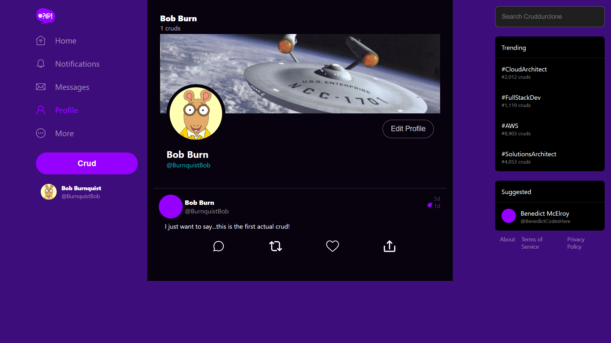
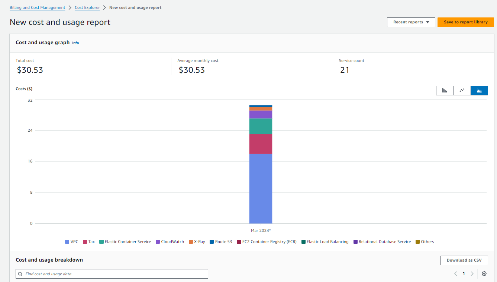
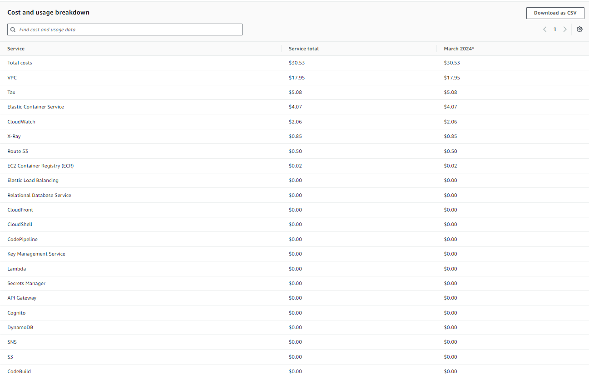
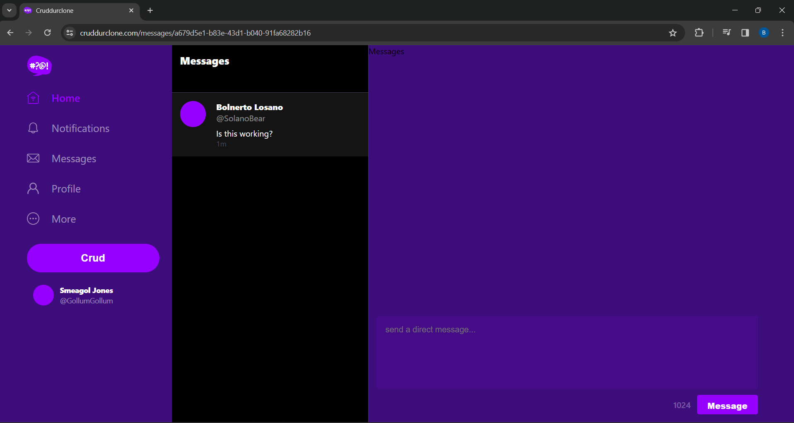
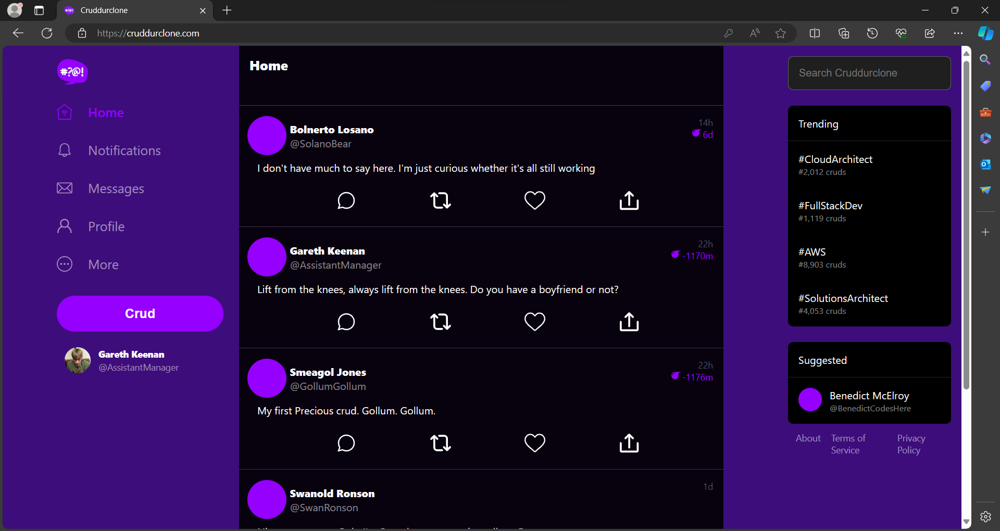

# Week 12 - Security and Cost Fixes

## Cleaning the Environment
After testing that the application is working, I performed a security audit on my application.

### Removing/Altering Sensitive Data
I want to make sure that the least amount of sensitive data is included in the codebase of the application.


Move environment variables offline
load in the dev variables from an s3 bucket
load in the production variables from parameter store or secrets manager

### Review Permissions Policies


## Cost

### Reducing Secrets Manager VPC Endpoints
See below. Reduced deployment to a single AZ.

### Post Confirmation Lambda
See below. Reduced deployment to a single AZ.

## General Config

### Configuring XRay

### Configuring the machine user permissions
The machine user we configured essentially is what we have made as the task role for the backend-flask task. We want the backend to be able to have the permissions necessary to perform the actions needed, and no more than this.

We want to make sure that the most granular, least privilege permissions possible are granted to the task in order for it to perform its role. 

We have xray as a sidecar container.


### UI Cleanup
- Fixing the styling of the page so the `section` sidebar on the right-hand side  

## Data Propagation - Display Name
the `display_name` property that we are updating in our User Profile page is not propagating through to the sidebar. This shows that there is some stale data that we are retrieving or that we are not fully updating. The local database shows the correct `display_name` following the update on the `ProfileForm` and refresh of the page, however the sidebar still shows the outdated data. The same is in fact true on the `UserFeedPage` where the `user` component contains the outdated `display_name`, but `profile` I am assuming shows the correct `display_name`.

## IMPORTANT - Prod and Dev writes to the respective databases


## Production Testing

### CORS
Upated CORS policy for API Gateway to be configured correctly for Production origin.

### Update Profile - HTTP Methods
Made sure that the `PUT` request being made to update the User Profile (display name and bio) is allowed in the CORS configuration for Flask.


## Sync Script - Issues with CloudFront Invalidation
For some reason, both times when I have tried to update the rootbucket files with the updated build of the frontend, I then get `Access Denied` and so far have been unable to figure out why, despite troubleshooting. I have had to delete and redeploy the CloudFormation stacks, and then on the fresh upload of the new build to the rootbucket, it works fine.


## Next Steps Following Deployment
###  Data Discrepancies



Attempting to fix the data propagation issues for the profile, as currently there is a discrepancy between the `display_name` in the `DesktopNavigation` element and the rest of the application. This is down to the data being retrieved via the `loadData` function, `user` variable and the `profile` which gets set as a state variable in the `UserFeedPage`, as well as the activities which render with the correct user `display_name`. Both the `profile` variable and the `activities` data rely on updating and reading the `display_name` from the postgres database, which contains the up-to-date `display_name`, rather than the `Cognito User Pool` which stores as an attribute the `Username` that the user registered with.

The best way to resolve this would be to retain the concepts of a separate `user` related to retrieving Cognito data, and a `profile` variable related to the up-to-date postgres data. 

For secure authentication of the application, I have to be careful to make sure I don't modify the way the verification of identity works in my application.

The aim is to refactor the application so that it uses a useContext.

1. Creating a User Context
First, create a context specifically for the user profile information. 
`ProfileContext.js`:

```js

import React, { createContext, useContext, useState, useEffect } from 'react';

// Create the context
export const ProfileContext = createContext();

// Create a custom hook for using the user context
export const useProfile = () => useContext(ProfileContext);

// Provider component that wraps your app and makes user info available everywhere
export const UserProvider = ({ children }) => {
    const [profile, setProfile] = useState(null);

    // You could also fetch user profile here if you have authentication setup
    useEffect(() => {
        // Dummy function to fetch profile data
        const fetchProfile = async () => {
            // Replace this with your actual fetch call to your backend
            const fetchedProfile = await fetchUserProfileFromDatabase();
            setProfile(fetchedProfile);
        };

        fetchProfile();
    }, []);

    return (
        <ProfileContext.Provider value={{ profile, setProfile }}>
            {children}
        </ProfileContext.Provider>
    );
};

```
`fetchUserProfileFromDatabase()` is a placeholder for the function used to retrieve the user's profile from the backend. The useEffect hook ensures this data fetch happens when the provider mounts.

2. Wrapping Your App with the UserProvider
In your App.js or equivalent file, wrap your component tree with UserProvider to make the profile state accessible throughout your app:    

```js

import React from 'react';
import { UserProvider } from './ProfileContext'; // Adjust the path as necessary

function App() {
    return (
        <UserProvider>
            {/* Your app's routing and other components */}
        </UserProvider>
    );
}

```


3. Updating and Accessing Profile Data
In `ProfileForm`:

```js

import React from 'react';
import { useProfile } from './ProfileContext'; // Adjust the path as necessary

const ProfileForm = () => {
    const { profile, setProfile } = useProfile();

    const handleProfileUpdate = (updatedProfile) => {
        // Update the profile in the context
        setProfile(updatedProfile);
        // Also send this updated profile to your backend
        updateProfileInDatabase(updatedProfile);
    };

    // Your form handling and rendering logic here
};


```


### Separating Concerns Further between Dev and Prod Environments
Creating a separate Cognito user pool would make the most sense, as this would allow a fully separate architecture, whereas currently the data that is in the dev application related to users and activities, relies on the same user pool as production. This means that the management of side effects from changes to user and profile related information has to be managed very carefully in the current architecture. It would be much better practice to have separate user pools.

### Messages Functionality
The messaging was able to work in development, however since refactoring the frontend layout there is no sidebar containing the message groups. I need to test this again in development to check whether the sidebar will be created once I create some messages between users. The ddb database is run locally for development, so this shouldn't be an issue when it comes to data conflicts or corruption, the main need is to separate the architecture for the users fully, i.e. the `Cognito User Pool` and the `Postgres database`.


## Cost Reduction
You can see here the costs are mounting:





In order to mitigate this, I have to consider some tradeoffs.

For my current use case, which is using this application as a demonstration of my skills and something to build with progressively, I am happy to sacrifice the very high levels of availability and fault tolerance that come from deploying much of my application architecture across three separate Availability Zones.

The obvious areas that are hitting my budget are the public IPv4 addresses in my VPC, which are being charged at a flat hourly rate of $0.005 per IP.

A direction for development would be a shift where possible away from IPv4 to IPv6, as it is the scarcity of IPv4 addresses that is causing costs to be passed on to the 
AWS user.

### VPC Endpoints
I have a `VPC Endpoint` for `Secrets Manager` deployed across three AZs in private subnets. I am happy to reduce this down to a single subnet to reduce the costs for this by 2/3rds, without compromising security by still making sure that the calls to the backend don't traverse the internet but remain in the private AWS network.

### Post Confirmation Lambda
I have done similar with the Lambda. It is now in one AZ as opposed to the three that it was deployed in before, and the AZ is different from the AZ of the `VPC Endpoint` for `Secrets Manager`. I have tested this in production and it still works.


Reducing these two services takes away 4 of the public IPs that were incurring costs every hour, which is a saving of ($0.005 * 4 * 24) which is $0.48 per day or $14.40 every 30 days.


## Messaging Feature
The messaging feature does appear to work.





There are a few problems that I aim to fix.

1. The sidebar on the right hand side doesn't render the existing conversation, the existing `MessageGroup`, properly. 
    - There should be a visible conversation as I replied to the message `Is this working?` from the other user.
    - It is worth noting and remembering the structure of the endpoints, as the selected message group uuid is displayed.

2. Currently a hack is required to start a new message group between two users. After `messages/` in the URL, you have to put `new/:handle` replacing the `:handle` with the handle of the user you want to DM. 
    - After doing this, it rendered the correct user's display name and handle.

The aim would be to create a feature that displays on another user's posts or somewhere in the UI, and clicking on it takes you to that `messages/new/:handle` endpoint.

## Avatar Inconsistently Rendering



The profile picture or `ProfileAvatar` is only rendering on certain pages or certain components. You can see it in the image above, that the user's avatar renders in the `DesktopNavbar`, and not in the `ActivityFeed`.

